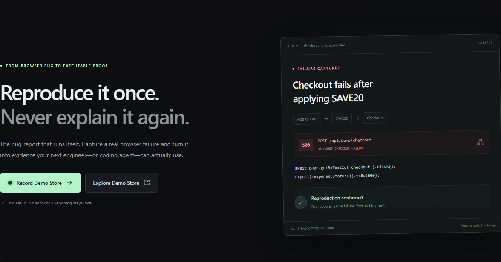
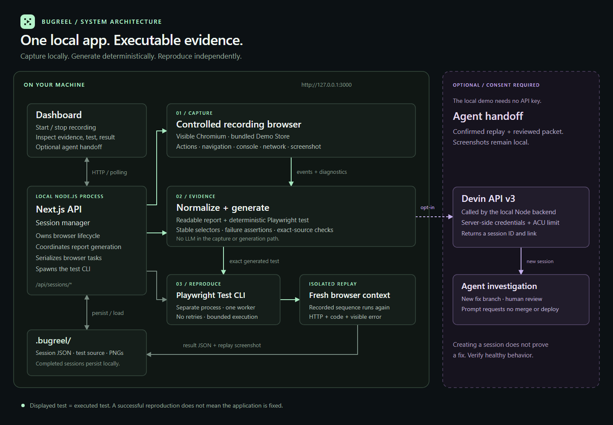

<div align="center">
  
  <h1>BugReel</h1>
  <p><strong>Reproduce it once. Never explain it again.</strong></p>
  <p>Turn a browser bug reproduction into diagnostic evidence, an executable Playwright test, and an actionable agent handoff.</p>
  <p><strong>Local-first</strong> · <strong>Deterministic generation</strong> · <strong>Verified reproduction</strong> · <strong>Optional Devin integration</strong></p>
  <p>
    <a href="https://github.com/Rekh-225/bugreel/actions/workflows/ci.yml"></a>
    <a href="LICENSE"></a>
    
    
    
  </p>
  <p>
    <a href="#quick-start">Quick start</a> ·
    <a href="#demo-walkthrough">Demo</a> ·
    <a href="#architecture">Architecture</a> ·
    <a href="#optional-devin-handoff">Devin handoff</a> ·
    <a href="#testing">Testing</a>
  </p>
</div>

> **Local developer tool — no hosted URL.** The complete MVP runs on a desktop with Node.js and Playwright. No account, database, or API key is required for recording and reproduction.



## Why BugReel?

“Checkout doesn't work after applying a discount” is a starting point, not a reproducible bug report. Before fixing it, an engineer or coding agent still needs the exact actions, the failure condition, and evidence of what happened.

BugReel captures that context while a person reproduces the problem, then checks the scenario independently in a fresh browser.

**A screen recording shows what happened. BugReel produces instructions a computer can execute.**

| Capture | Evidence | Reproduce | Hand off |
| --- | --- | --- | --- |
| Record real interactions in a controlled browser. | Preserve steps, console errors, network failures, and a screenshot. | Generate and execute the exact Playwright test shown in the report. | Copy an agent-ready packet or explicitly start a Devin session. |

## Design principles

| Principle | How BugReel applies it |
| --- | --- |
| **Human in the loop** | A person reproduces the bug in a real, visible browser. BugReel captures evidence; it never guesses what happened. |
| **Deterministic by design** | Report and test generation are template-based. No LLM sits between the recording and the executable test, so the same recording always produces the same test. |
| **Verify before you hand off** | The generated test is hash-checked and re-executed in a fresh browser. A coding agent only receives a failure that was independently confirmed. |
| **Honest outcomes** | Three distinct results: REPRODUCTION CONFIRMED, NOT REPRODUCED, REPLAY ERROR. A selector timeout or browser crash is never reported as a confirmed bug. |
| **Safe by default** | Local-only storage, explicit per-submission consent, a visible ACU spend limit, and no automatic retries for the optional Devin handoff. |

## Quick start

### Requirements

- **Node.js 22.x** and npm. Development and verification used Node.js 22.
- A **desktop environment** for the visible recording browser.
- Port **3000** available on the local machine.
- Playwright Chromium, installed by the command below.

### Install and run

```bash
git clone https://github.com/Rekh-225/bugreel.git
cd bugreel
npm ci
npx playwright install chromium
npm run build
npm run start
```

Open **http://127.0.0.1:3000** and click **Record Demo Store**.

Use that exact origin, including port 3000. Browser-control requests intentionally reject other origins; `localhost` is not interchangeable with `127.0.0.1` in the current configuration.

On Linux, if browser system dependencies are missing:

```bash
npx playwright install --with-deps chromium
```

Interactive recording still requires a graphical desktop. A headless server alone does not provide the user-visible recording window.

For development, use `npm run dev` instead of the build/start commands. Do not run a second server on the same port.

## Demo walkthrough

The bundled Demo Store contains one product and a deliberately reproducible checkout bug. There are no real orders, purchases, or payments.

1. Open BugReel and click **Record Demo Store**.
2. In the separate browser, click **Add to Cart**.
3. Enter **SAVE20** and click **Apply Discount**.
4. Click **Checkout** and wait for the visible failure.
5. Return to BugReel and click **Stop & Generate Report**.
6. Inspect the reproduction steps, network evidence, console evidence, screenshot, and generated test.
7. Click **Run Reproduction**.
8. The generated test repeats the actions in a fresh browser context and reports **REPRODUCTION CONFIRMED**.

### The intentional failure

| Checkout state | Expected application behavior |
| --- | --- |
| Product in cart, no applied discount | HTTP 200 and a visible success state. |
| SAVE20 entered but not applied | Normal checkout succeeds. |
| Invalid discount rejected | Normal checkout remains available. |
| SAVE20 successfully applied | HTTP 500, `DISCOUNT_CHECKOUT_FAILURE`, a console error, and a visible checkout failure. |

The failure is part of the demonstration fixture, not an accidental startup error. Recorded checkout retries are preserved in the generated scenario; reproduction assertions evaluate the final checkout outcome.

## Understanding the result

| Outcome | What it means |
| --- | --- |
| **REPRODUCTION CONFIRMED** | The generated test passed and observed the expected HTTP status, error code, and visible failure. |
| **NOT REPRODUCED** | The scenario completed, but the expected failure signature was absent. |
| **REPLAY ERROR** | Browser, selector, timeout, worker, or infrastructure problems prevented a conclusive reproduction. |

> **A passing reproduction test means the bug was observed—not that the application is fixed.** This is a characterization test of the existing failure. A proper fix also needs a healthy-behavior regression test, such as successful checkout with HTTP 200 and no error banner.

BugReel does not treat an arbitrary failed test or nonzero process exit as proof of reproduction.

## Architecture



[Open the full-size diagram](docs/architecture.png) · [Editable SVG source](docs/architecture.svg)

### 1. Record a real browser session

The local Next.js server launches a visible Chromium browser with an isolated context. An initialization script captures supported interactions and forwards them through a Playwright binding. Browser listeners collect console errors, page exceptions, navigation, transport failures, and HTTP error responses.

For the Demo Store, stable `data-testid` selectors identify the controls. The recorder also has selector representations for IDs, labels, placeholders, text, and CSS; it does not claim universal selector support.

### 2. Normalize actions and preserve evidence

Consecutive typing events become a meaningful `fill` action. Input-focus clicks are omitted, and submit-button clicks are not duplicated as a second form submission. The captured action order is preserved.

HTTP error responses and transport failures are captured separately: an HTTP 500 is a received response, not a Playwright `requestfailed` event. The failure screenshot is captured after the checkout error becomes visible. If failure capture is unavailable, the application can capture a clearly labeled stop-state screenshot instead.

### 3. Generate the report and executable test

Templates produce the readable report and Playwright source from normalized actions. An LLM is not involved in recording, normalization, report generation, or test generation.

The generated test registers a response wait before clicking Checkout, then checks the known Demo Store failure signature. The report displays the same source that is saved for execution.

### 4. Execute independently

The server verifies the saved source, its SHA-256 hash, and deterministic regeneration before launching the Playwright Test CLI in a separate process. The run uses a fresh browser context, one worker, no retries, and bounded execution time.

A structured test report and evidence attachment determine the result. The replay screenshot is separate from the original recording screenshot.

### 5. Persist locally; share only by choice

Active browser handles live in a process-global session manager. Completed session metadata, test source, screenshots, and run artifacts are stored under `.bugreel/`, which is excluded from Git. One browser task runs at a time; an agent submission also uses the task lock while it is being sent.

The dashboard polls local API routes for updates. No database, message broker, or separate microservice is required.

### Technology stack

| Layer | Technology |
| --- | --- |
| Application and API | Next.js 16 App Router, React 19, Node.js |
| Language | TypeScript |
| Interface | Tailwind CSS 4 and custom CSS |
| Recording and automation | Playwright and Playwright Test |
| Session persistence | Local JSON and artifact files |
| Optional coding-agent integration | Devin API v3 |

## What a session contains

The shared [session model](src/lib/session.ts) keeps the evidence explicit:

- Metadata: session ID, timestamps, start URL, and lifecycle status.
- Recorded events and normalized actions.
- Console errors, uncaught page exceptions, and network errors.
- Screenshots with capture reasons and timestamps.
- A failure signature and structured report.
- Generated test source, hash, and generation version.
- The latest reproduction result and optional agent-handoff status.

Runtime artifacts are organized approximately as follows:

```text
.bugreel/
└── sessions/
    └── <session-id>/
        ├── session.json
        ├── reproduction.spec.ts
        ├── recorded-failure.png
        ├── replay-<run-id>.png
        └── runs/
            └── <run-id>/
                ├── result.json
                └── test-output/
```

Completed reports survive application restarts. An interrupted recording or an unfinished replay is not silently reclassified as successful.

## Optional Devin handoff

### Without credentials

Every report with a generated test can produce a **Copy Agent Packet** or **Download packet** export. The Markdown packet includes:

- The report and recorded steps.
- Console and network evidence.
- The exact generated Playwright test.
- Repository context and instructions for independent reproduction.
- Instructions to investigate on a separate branch, without merging or deploying.

The packet records repository context at **handoff time**, not capture time. Local uncommitted changes, screenshot image bytes, and API credentials are **not** included. Screenshots can be attached manually if needed.

### Enable Send to Devin

Configure an authorized Devin API v3 credential and organization ID in your local server environment or an untracked `.env.local` file:

```dotenv
DEVIN_API_KEY=
DEVIN_ORG_ID=
DEVIN_MAX_ACU_LIMIT=10
```

Fill the first two values locally, then restart BugReel. A service-user key with session-creation permission is recommended for the integration. The optional ACU limit defaults to 10 and accepts integers from 1 to 100.

Never put credentials in frontend code, `NEXT_PUBLIC_` variables, screenshots, or GitHub. The core application remains usable without this configuration.

**Send to Devin** requires:

1. A confirmed reproduction of the generated test.
2. Review of the exact packet being sent.
3. Explicit consent to share the evidence and consume account credits.
4. Confirmation of the displayed ACU limit.

A successful submission returns an **Open Devin Session** link. It means a session was created—not that a fix has been completed or verified. Pending, successful, and uncertain submissions are not automatically resent; if a request times out, check Devin before retrying.

The Demo Store bug is intentional. Any experimental fix should stay on a separate branch so the working demonstration remains available on `main`.

## Testing

> **Stop the normal application server before running the full test suite.** Playwright starts its own test-enabled server. Reusing a normal server without the test-only browser connection causes recording tests to fail.

```bash
npm run typecheck
npm test
```

Coverage includes:

- Healthy checkout, applied SAVE20 failure, unapplied codes, and invalid codes.
- Input normalization and submission deduplication.
- Deterministic generation, escaped values, unsupported inputs, and repeated checkout attempts.
- Execution of generated source by the actual Playwright CLI.
- Recording of network failures, HTTP errors, page exceptions, navigation, and screenshots.
- Complete positive and negative UI workflows, plus a real selector-error replay.
- Consent, packet integrity, usage limits, duplicate submissions, and uncertain handoff outcomes.
- Responsive layouts and Windows-specific visual baselines.

Devin API tests use mocked transports or browser routes and do not create paid cloud sessions. Pixel comparisons run only on Windows because the committed baselines are Windows-specific; functional UI checks run on every platform. The saved-session recovery test is opt-in through `BUGREEL_RECOVER_SESSION`.

For additional verification commands and test-environment details, see [AGENTS.md](AGENTS.md).

Continuous integration runs the same typecheck, production build, and full Playwright suite on every push to `main` (see [.github/workflows/ci.yml](.github/workflows/ci.yml)). Recording and replay browsers run headed under Xvfb on the Linux runner.

## Repository structure

```text
src/
├── app/
│   ├── page.tsx                       Landing and recording entry point
│   ├── demo-store/                    Deterministic target application
│   ├── sessions/[id]/                 Recording and report view
│   └── api/                           Checkout and session-control routes
├── components/                        Dashboard, evidence, test, and handoff UI
└── lib/
    ├── session.ts                     Serializable session types
    ├── generation.ts                  Deterministic report and test generation
    ├── replay-result.ts               Reproduction-result classification
    ├── agent-packet.ts                Agent-ready report export
    ├── recorder/                      Browser instrumentation and normalization
    └── server/                        Recording, persistence, replay, and Devin client
tests/                                 Unit, browser, workflow, and visual checks
docs/                                  Architecture artwork
playwright.config.ts                   Project verification configuration
playwright.reproduction.config.ts      Generated-test execution configuration
```

## Troubleshooting

| Symptom | What to check |
| --- | --- |
| Browser-control request is rejected | Open `http://127.0.0.1:3000`, not another host or port. |
| Chromium cannot launch | Run `npx playwright install chromium`; ensure a desktop and required system dependencies are available. |
| Port 3000 is already in use | Use the existing BugReel server or stop it before starting another instance. |
| A report has no generated test | The recording must contain a checkout click. Captured evidence remains available; a failed generation can be retried with **Generate Playwright Test**. |
| Recording tests cannot connect to port 9333 | Stop the normal app server and let `npm test` start the test-enabled server. |
| The app shows REPLAY ERROR | Inspect execution details. Browser/selector/infrastructure failures are intentionally not reported as confirmed bugs. |
| Devin API is not configured | Set the server-side values locally and restart. Copy/download still works. |
| Handoff outcome is unknown | Check Devin for an existing session; do not repeatedly submit the same request. |

For environments where only visible **replay** is unavailable, set `BUGREEL_REPLAY_HEADLESS=1` on the application server. Recording still requires a visible browser.

## Scope and deployment boundaries

This MVP is deliberately narrow:

- Supported target: the bundled, single-tab Demo Store.
- Local desktop execution, not a browser extension or packaged desktop installer.
- No arbitrary external website recording, multi-user accounts, hosted recording service, or automatic merging of fixes.
- No video/session playback engine; evidence consists of structured events, diagnostics, and screenshots.

Deploying the Next.js UI to a serverless host does **not** turn the current application into a remote recording service. Its visible browser, active in-process state, writable local artifacts, and test subprocesses are part of the local architecture. A public tunnel also does not make the controlled browser appear on a visitor's device. Do not publicly expose the browser-control or paid-handoff endpoints unchanged.

## Built with Devin

BugReel was built with Devin Desktop during the Cognition Devin hackathon. The project owner defined the product concept, demonstration scenario, scope, priorities, and acceptance criteria, and manually validated the experience. Devin implemented the application, browser instrumentation, evidence pipeline, deterministic generator, replay runner, UI, and automated verification.

The optional cloud handoff is a separate product feature: it supplies a coding agent with reproducible evidence rather than asking an LLM to invent the recording or the test.

---

**Less back-and-forth. More fixing.**
